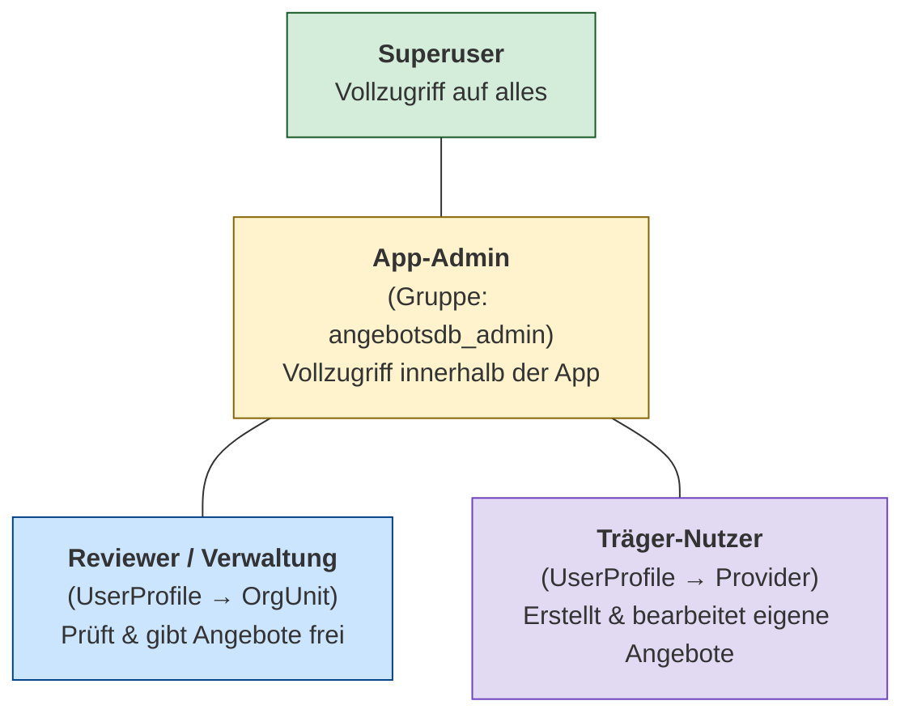
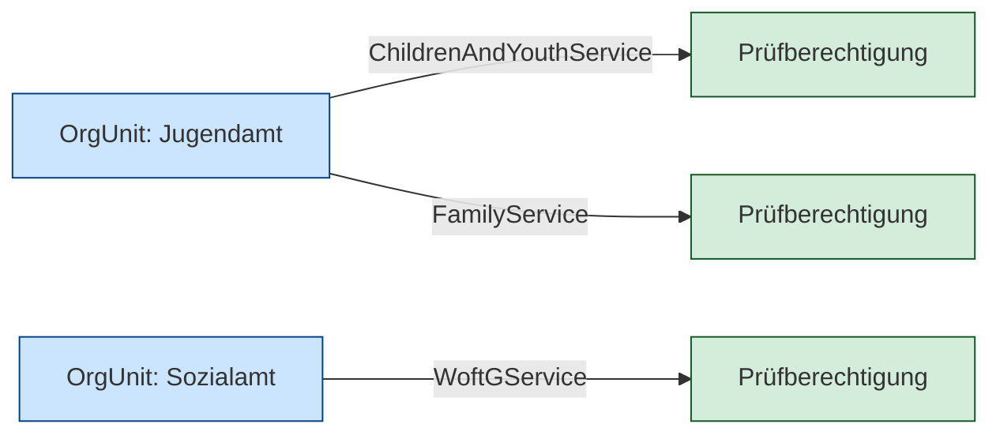

# Rechte und Rollen

[← Zurück zur Übersicht](../README.md)

Die Zugriffsteuerung basiert auf **Django-Gruppen** und dem Zusammenspiel
von `UserProfile`, `OrgUnit` und `OrgUnitServicePermission`.

## Gruppen

| Gruppe             | Beschreibung                                                     |
| ------------------ | ---------------------------------------------------------------- |
| `angebotsdb_admin` | Vollzugriff auf alle Angebote, Stammdaten und Benutzerverwaltung |
| `angebotsdb_user`  | Eingeschränkter Zugriff, abhängig vom zugewiesenen Profil        |

## Rollen-Hierarchie

## Berechtigungsmatrix

| Aktion                      | Superuser | App-Admin | Reviewer (OrgUnit) | Träger-Nutzer (Provider) |
| --------------------------- | :-------: | :-------: | :----------------: | :----------------------: |
| Angebot erstellen           |     ✅     |     ✅     |         ❌          |            ✅             |
| Eigenes Angebot bearbeiten  |     ✅     |     ✅     |         ❌          |            ✅             |
| Fremdes Angebot bearbeiten  |     ✅     |     ✅     |         ❌          |            ❌             |
| Zur Prüfung einreichen      |     ✅     |     ✅     |         ❌          |            ✅             |
| Angebot prüfen (Review)     |     ✅     |     ✅     |         ✅          |            ❌             |
| Angebot freigeben/ablehnen  |     ✅     |     ✅     |         ✅          |            ❌             |
| Stammdaten verwalten        |     ✅     |     ✅     |         ✅          |            ❌             |
| Benutzerverwaltung          |     ✅     |     ✅     |         ❌          |            ❌             |

> **Hinweis:** Reviewer können nur Angebote prüfen, deren Typ über eine
> `OrgUnitServicePermission` ihrer Organisationseinheit zugeordnet ist.

## OrgUnit-Service-Berechtigungen

Die Zuordnung, welche OrgUnit welche Angebotstypen prüfen darf, wird
über das Modell `OrgUnitServicePermission` gesteuert:

