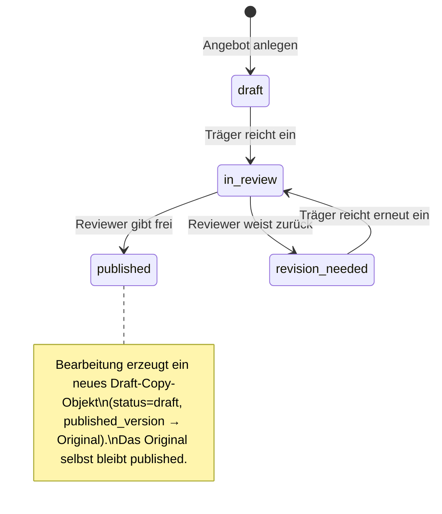
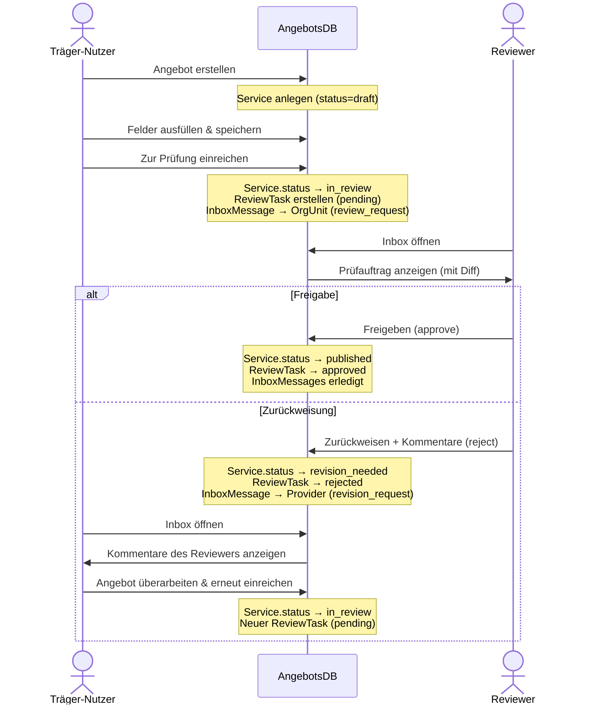
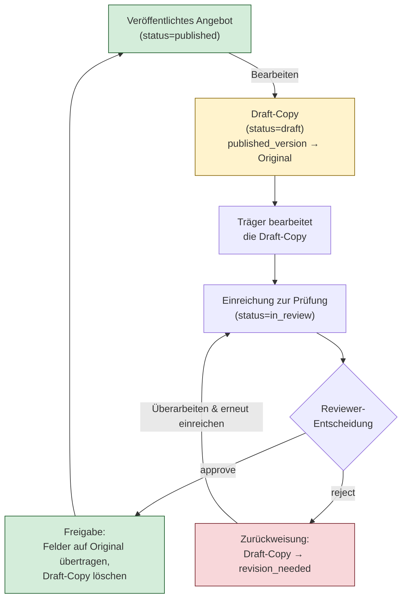

# Redaktionsprozess

[← Zurück zur Übersicht](../README.md)

Jedes Angebot durchläuft einen definierten Statuslebenszyklus. Die vier möglichen Status sind:

| Status             | Bedeutung                                             |
| ------------------ | ----------------------------------------------------- |
| `draft`            | Entwurf – wird vom Träger bearbeitet                  |
| `in_review`        | Zur Prüfung eingereicht – wartet auf Reviewer         |
| `revision_needed`  | Vom Reviewer zurückgewiesen – Überarbeitung nötig     |
| `published`        | Freigegeben und veröffentlicht                        |

## Status-Übergänge

## Ablauf im Detail

## Review mit Diff-Anzeige

Bei jeder Einreichung wird ein **Snapshot** des aktuellen Zustands erstellt
(`submitted_snapshot`). Wurde das Angebot zuvor bereits einmal freigegeben, wird der damalige
Snapshot als `approved_snapshot` gespeichert. Auf dieser Basis kann der Reviewer eine
**Diff-Ansicht** nutzen, die geänderte Felder hervorhebt.

---

## Draft-Copy-Mechanismus

Wird ein bereits **veröffentlichtes** Angebot bearbeitet, bleibt das Original unverändert
öffentlich sichtbar. Stattdessen wird eine **Draft-Copy** erstellt:

**Wichtige Eigenschaften:**

- Pro veröffentlichtem Angebot und Träger existiert **maximal eine aktive Draft-Copy**.
- Die Draft-Copy verweist über `published_version` auf das Original.
- Bei **Freigabe** werden alle Felder der Draft-Copy via `apply_draft_to_published()` auf das
  Original übertragen und die Draft-Copy gelöscht.
- Bei **Zurückweisung** bleibt die Draft-Copy erhalten und kann überarbeitet werden.
- `ServiceImage`-Einträge werden bei der Erstellung der Draft-Copy mitkopiert und bei der
  Freigabe auf das Original umgehängt.

---

## Inbox und Benachrichtigungen

Die App verfügt über ein internes **Inbox-System** (`InboxMessage`), das Reviewer und
Träger-Nutzer über anstehende Aufgaben informiert:

| Nachrichtentyp      | Empfänger | Auslöser                              |
| -------------------- | --------- | ------------------------------------- |
| `review_request`     | OrgUnit   | Träger reicht Angebot zur Prüfung ein |
| `revision_request`   | Provider  | Reviewer weist Angebot zurück         |

Nachrichten haben die Flags `is_read` und `is_resolved`. Nach Abschluss eines Review-Vorgangs
werden die zugehörigen Nachrichten automatisch als `is_resolved=True` markiert.