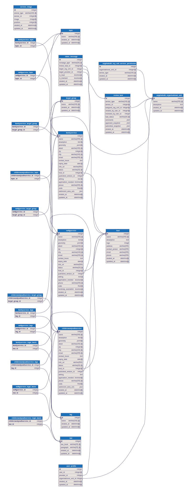

# Technische Details

[← Zurück zur Übersicht](../README.md)

## Datenmodell



### Stammdaten (Lookup-Tabellen)

| Modell        | Zweck                                   |
| ------------- | --------------------------------------- |
| `Provider`    | Träger / anbietende Einrichtung         |
| `Topic`       | Kategorien zur Klassifizierung          |
| `TargetGroup` | Zielgruppen (z. B. Jugendliche, Eltern) |
| `Tag`         | Freie Schlagworte                       |
| `Law`         | Gesetzliche Grundlagen (§ + Gesetzbuch) |

## Eigene Datenbank

Die AngebotsDB nutzt eine **dedizierte PostgreSQL-Datenbank**. Das Routing erfolgt über den zentralen `DatabaseRouter` in `datenwerft/db_routers.py`. Migrationen erfordern daher immer das Flag `--database=angebotsdb`:

```bash
uv run manage.py makemigrations angebotsdb
uv run manage.py migrate angebotsdb --database=angebotsdb
```

## Cross-Database-Einschränkungen

Da Django keine datenbankübergreifenden Foreign Keys unterstützt, werden Verweise auf das Django-`User`-Modell (das in der `default`-Datenbank liegt) über `IntegerField`-Felder (`user_id`, `created_by_user_id`, `reviewed_by_user_id`) realisiert. Die Auflösung zum `User`-Objekt erfolgt über Properties, die explizit `.using('default')` verwenden.

Ebenso wird anstelle von `ContentType`/`GenericForeignKey` die Kombination aus `service_type` (Modellname als String) und `service_id` (PK) verwendet.

## Generische CRUD-Views

Die URL-Registrierung erfolgt **automatisch** für alle nicht-abstrakten Modelle der App. Für jedes Modell werden List-, Create-, Update-, Detail- und Delete-Views generiert. Modelle mit `_exclude_from_crud = True` (z. B. `ServiceImage`) werden übersprungen.

## PyGeoAPI-Integration

Bestimmte Felder (z. B. `catchment_area_urls` für Einzugsgebiete) beziehen ihre Auswahl-Optionen dynamisch von einer [OGC API Features](https://ogcapi.ogc.org/features/)-Schnittstelle (`PyGeoAPIMultipleChoiceField`). Die URIs der ausgewählten Features werden als JSON-Liste gespeichert.

## Dashboard

Die Startseite der App zeigt ein konfigurierbares Dashboard mit Kacheln für die Angebotstypen und gruppierten Buttons für Stammdaten und Benutzerverwaltung. Das Layout kann vom Nutzer individuell angepasst und gespeichert werden.
